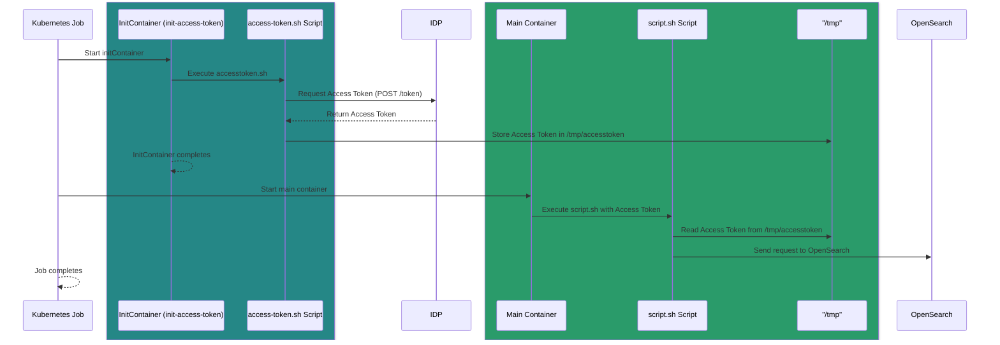

# opensearch-task

 

A Helm chart for deploying an kubernetes job which can call OpenSearch API via OAuth2.

## Introduction

This helm chart provides scaffolding for deploying a Kubernetes job for executing ad-hoc commands on an OpenSearch cluster via GitOps. 
These tasks are typically necessary when they fall outside the scope of a specific service or cannot be addressed through the OpenSearch Dashboard by a personalized user
or by a personalized user with shell access to the cluster.

### Prerequisites

Ensure that the Kubernetes job is configured to obtain credentials for a user mapped to the appropriate OpenSearch role through `backendRoles`. 
The `OpenSearchRole` must have the necessary permissions in OpenSearch to perform the desired actions.

### Design

### valuesSection

By default, it uses `redhat/ubi8` which contains `curl` and uses the `nobody` user.
Secrets for client credentials and OpenSearch CA are mounted as volumes. These secrets needs
to be created before deploying the job.

## Values

| Key | Type | Default | Description |
|-----|------|---------|-------------|
| image | object | `{"pullPolicy":"IfNotPresent","repository":"redhat/ubi8","tag":"8.10"}` | the image to use for the task |
| image.repository | string | `"redhat/ubi8"` | The image repository to pull from |
| image.tag | string | `"8.10"` | The image tag to pull |
| image.pullPolicy | string | `"IfNotPresent"` | The image pull policy |
| job.name | string | `"example-administrative-job"` | The name of the job |
| job.namespace | string | `"opensearch-gitops"` | The namespace to run the job in |
| job.annotations | object | `{"kustomize.toolkit.fluxcd.io/force":"true"}` | The annotations to apply to the job |
| job.labels | object | `{}` | The labels to apply to the job |
| env.OPENSEARCH_URL | string | `"https://opensearch.opensearch.svc:9200"` | The OpenSearch URL |
| env.TOKEN_URL | string | `"http://keycloak.keycloak.svc.cluster.local:8080/realms/cheetah/protocol/openid-connect/token"` | The token URL |
| env.OAUTH2_SCOPE | string | `"opensearch"` |  |
| secretNames.clientCredentials | string | `"client-credentials"` | The name of the secret containing the client ID and secret |
| secretNames.opensearchCa | string | `"opensearch-ca"` | The name of the secret containing the CA certificate |
| secretNameKeys.clientId | string | `"client-id"` | The key for the client ID in the client credentials secret |
| secretNameKeys.clientSecret | string | `"client-secret"` | The key for the client secret in the client credentials secret |
| resources | object | `{"limits":{"cpu":"20m","memory":"32Mi"},"requests":{"cpu":"10m","memory":"16Mi"}}` | The resources to allocate to the job |
| script.content | string | `"curl -s --cacert /tmp/security/ca.crt -X GET \"${OPENSEARCH_URL}/_cat/indices\" -H \"Authorization: bearer $(printf '%s' \"${ACCESSTOKEN}\")\"\n"` | The script to execute in the job |
| volumeConfig.opensearchCa.subPath | string | `"ca.crt"` | The subpath to the CA certificate in the secret |
| backoffLimit | int | `1` | The backoff limit for the job |
| securityContext.runAsNonRoot | bool | `true` | The user to run the container as |
| securityContext.readOnlyRootFilesystem | bool | `true` | Whether the root filesystem is read-only |
| securityContext.allowPrivilegeEscalation | bool | `false` | Whether to allow privilege escalation |
| securityContext.runAsUser | int | `65534` | The user to run the container as |
| securityContext.runAsGroup | int | `65534` | The group to run the container as |
| securityContext.fsGroup | int | `65534` | the filesystem group to run the container as |
| nodeSelector | object | `{}` |  |
| tolerations | list | `[]` |  |
| affinity | object | `{}` |  |

----------------------------------------------
Autogenerated from chart metadata using [helm-docs v1.11.0](https://github.com/norwoodj/helm-docs/releases/v1.11.0)
